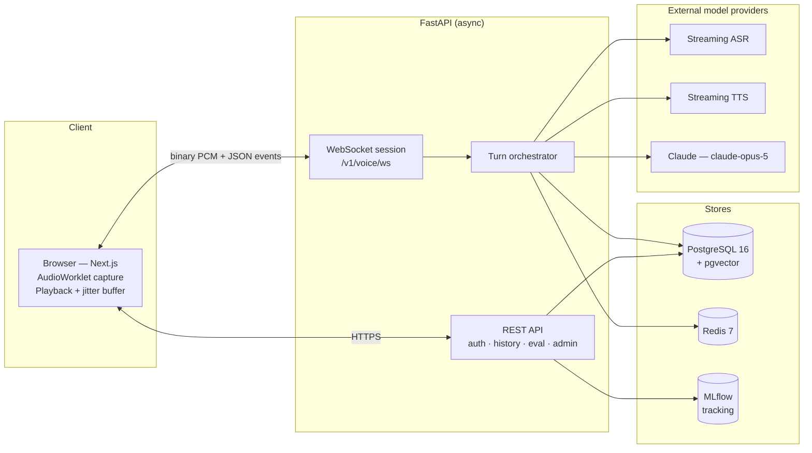
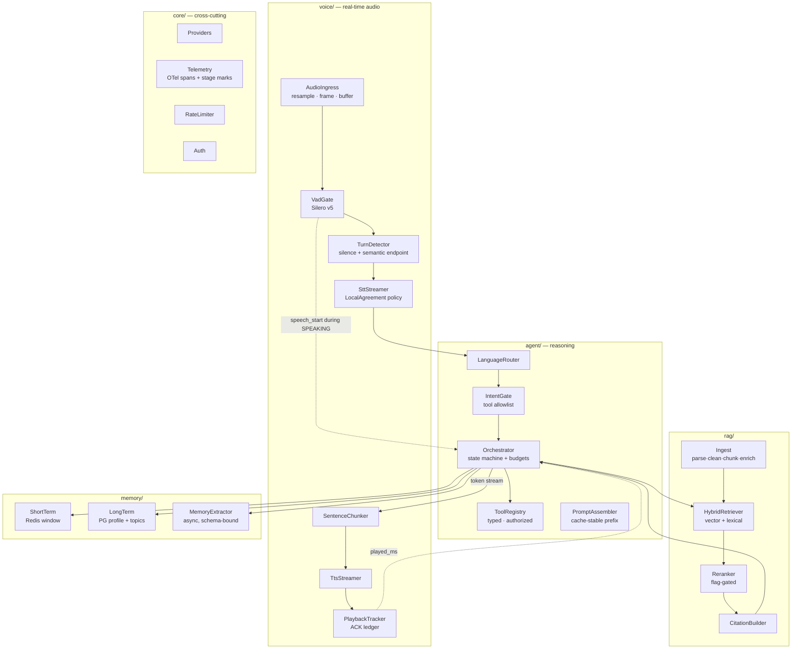
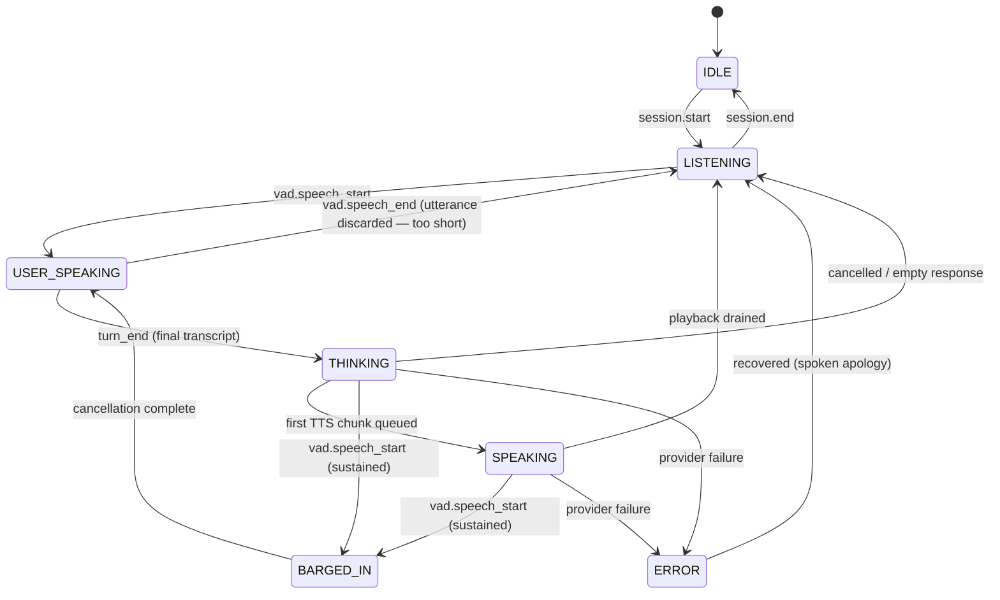
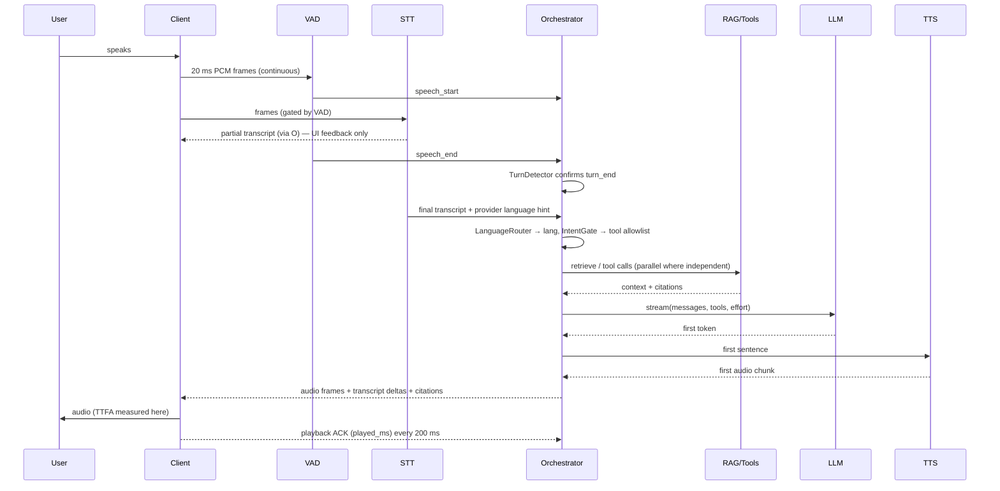
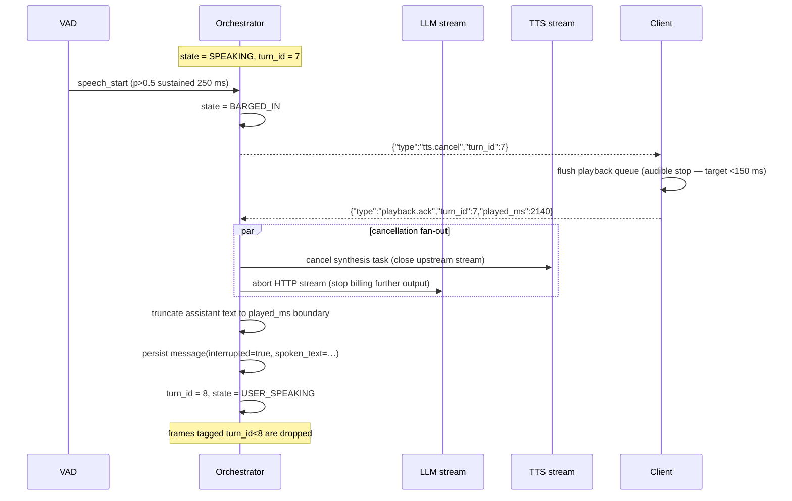
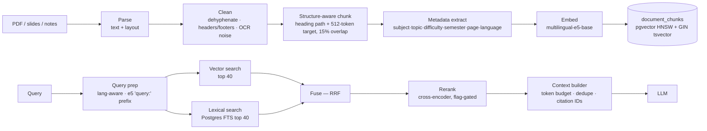

# VaaniOS — Architecture

**Status:** Phase 0 design. No implementation exists. Every performance figure below is a *budget*
(a design target and a test assertion), never a measurement.
**Audience:** the engineer implementing Phases 1–10, and reviewers of Audit Gate 0.

---

## 1. Design principles

These four principles decide most of the arguments that follow.

**P1 — Every stage is independently measurable.** The pipeline is a chain of typed interfaces with
instrumented boundaries. If end-to-end quality drops, the eval suites must attribute it to a stage
(STT, retrieval, tool selection, generation, TTS) without human guesswork. This is why the design
avoids opaque frameworks that own the control flow.

**P2 — Latency is a contract, not an outcome.** Each stage has a budget (§9). Budgets are asserted
in the voice-latency suite; a change that blows a budget fails, even if quality improved. Quality
improvements that cost latency must be argued explicitly as an experiment.

**P3 — Providers are replaceable; the application is not rewritten to compare them.** Model choice
is an experimental variable, so it lives in config behind an interface
([ADR-0016](adr/0016-provider-abstraction-boundaries.md)).

**P4 — Retrieved and transcribed content is untrusted input.** Course documents and user speech can
both contain instructions. Authority (who the student is, what a tool may do) never comes from model
output. See §8.4 and [SECURITY.md](SECURITY.md).

---

## 2. System context



**Trust boundaries.** (1) Browser → backend: all audio and text is untrusted. (2) Backend → external
providers: outbound payloads are subject to the data-minimisation rules in
[SECURITY.md](SECURITY.md#5-data-handling). (3) Ingested documents → prompt: retrieved text is data,
never instruction (§8.4).

---

## 3. Component architecture



### Responsibility notes

| Component | Owns | Explicitly does **not** own |
|---|---|---|
| `AudioIngress` | 48 kHz → 16 kHz resample, 20 ms Int16 framing, per-session ring buffer | Deciding whether audio is speech |
| `VadGate` | per-frame speech probability, hysteresis, `speech_start`/`speech_end` | Turn boundaries |
| `TurnDetector` | when the user's turn has *ended* (silence + optional semantic signal) | Cancelling anything |
| `SttStreamer` | stable-prefix partials + finals per utterance | Language decisions |
| `LanguageRouter` | per-utterance language/script decision + sticky session state | Translation |
| `Orchestrator` | the turn state machine, cancellation, tool/latency budgets, persistence | Prompt text (that's `PromptAssembler`) |
| `PlaybackTracker` | authoritative record of what audio the user actually *heard* | Playback itself |

---

## 4. The voice turn lifecycle

### 4.1 State machine



`BARGED_IN` is a real state, not a flag, because cancellation is asynchronous and multiple things
must complete before new audio may be attributed to a new turn. Transition legality is a unit-test
target (spec §10): the test matrix asserts every illegal edge raises, and that no path can leave two
`turn_id`s live at once.

### 4.2 Happy-path sequence



Nine stage marks are recorded per turn (§9) and persisted to `messages.latency_ms`.

### 4.3 Turn-end detection

Fixed silence thresholds are the usual reason voice agents feel slow. The design has two layers:

1. **Baseline (Phase 3):** Silero speech probability with hysteresis — enter speech at `p > 0.5`,
   leave at `p < 0.35`, require `min_speech = 250 ms` and `min_silence = 500 ms`. Deterministic and
   easy to test.
2. **Semantic endpointing (Phase 8, experiment EXP-003):** when the stable STT prefix parses as a
   complete question (terminal punctuation, or a lightweight completeness classifier), shorten
   `min_silence` to 250 ms. Rejected unless the voice-latency suite shows a turn-end latency
   improvement *without* a rise in premature cutoffs on the interruption dataset.

Layer 2 is a hypothesis, not a feature. It ships only with numbers.

---

## 5. Barge-in (interruption)

Mandatory per spec §10, and the single most architecture-shaping requirement in the project.

### 5.1 Why it is server-authoritative

A client-side mute is not an interruption: the LLM keeps generating (cost, and a conversation history
that diverges from what the user heard), and the next turn is built on a lie. The server owns
cancellation; the client owns only *immediate audible silence*.

### 5.2 Mechanism

Every turn gets a monotonically increasing `turn_id` used as a **fencing token**. All work for a turn
runs under one `asyncio.TaskGroup` rooted at a `TurnContext(turn_id, cancel_scope)`.



### 5.3 The subtle part: what the user actually heard

The LLM may have generated three sentences while only 2.14 s of audio reached the speaker. If the
full generated text is written to history, the next turn's context contains things the student never
heard — and the mentor will refer back to them. So:

- The client ACKs cumulative `played_ms` every 200 ms and immediately on flush.
- `PlaybackTracker` keeps a ledger mapping each TTS chunk to its `(text_span, byte_range, duration)`.
- On barge-in the assistant message is stored as the **spoken prefix** (`spoken_prefix_chars`), with
  the unspoken remainder kept in a separate column for debugging only, never replayed into context.

This is testable without audio hardware: a fake clock plus a scripted ACK stream asserts the stored
prefix for a given interruption point.

### 5.4 False interruptions and non-questions

Two separate guards, because they catch different things:

**Too short to be a question.** The VAD only announces speech after `min_speech_ms` (250 ms), so
every announced utterance clears that bar by construction — it is not a useful filter. A second,
higher threshold (`min_utterance_ms`, 400 ms) decides whether an utterance is a *question* rather
than merely speech. Without it a 300 ms "hmm" becomes a turn, complete with an LLM call and a
bill. (Found in Phase 3 by a test that expected a discard and got a turn.)

**Backchannels.** "Hmm", "haan", "achha", "sari" are agreement, not interruption, and satisfy any
duration threshold. They are matched against the *transcript*, not the audio, because "haan" and
"haan, lekin…" are acoustically similar and semantically opposite. Whole-utterance match only.
A cough or a lexical backchannel ("hmm", "haan") should not kill a good explanation. Mitigations:
`min_speech = 250 ms` before cancelling, and a configurable backchannel stoplist checked against the
first partial; if the utterance turns out to be a backchannel, the turn is *not* resumable (audio is
already flushed) — an accepted limitation recorded as [R-08](RISKS.md).

### 5.5 Audio pre-roll — the barged-in utterance must keep its first word

Barge-in only fires after `min_speech = 250 ms` of sustained speech, and upstream audio is VAD-gated.
Naively, the ASR would receive the interrupting utterance starting 250 ms late — "Wait, stop" arrives
as "stop", and the mentor answers the wrong question.

`AudioIngress` therefore keeps a **500 ms rolling pre-roll ring buffer** of *all* frames, gated or
not. When speech is confirmed, the buffer is flushed to the ASR ahead of the live frames, so the
utterance the ASR sees begins before the VAD decision did. This applies to normal turns too, where
the same truncation would otherwise clip the first phoneme. The e2e suite asserts the first word of an
interrupting utterance survives.

### 5.6 Distinguishing an interruption from a continued thought

A student who pauses 600 ms mid-sentence has their turn committed by the turn detector, and then keeps
talking — which looks exactly like a barge-in. Treating it as one wastes an LLM call and, worse,
splits one question into two turns.

Rule: if speech resumes **before any audio has been played** for the new turn (`played_ms == 0`) and
within `merge_window = 1200 ms` of the turn commit, the new utterance is **merged** into the previous
user turn rather than starting a new one — the in-flight generation is cancelled, the transcripts are
concatenated, and the turn is re-run with `turn_index` unchanged. Past that window, or once the
student has heard anything, it is a genuine interruption.

This is a UX correctness rule with a measurable cost (one wasted partial generation), and it is
testable with a fake clock.

### 5.7 Tool side effects survive cancellation

Cancelling a turn does not undo a tool call that already ran. If `update_student_progress` committed
before the student interrupted, the write stands.

Rules: every mutating tool is a single transaction, idempotent on retry (keyed by
`(session_id, turn_index, tool_name, args_hash)`), and tool execution is **never** cancelled
mid-flight — cancellation waits for in-flight tool calls to finish or time out, then discards their
results. Cancellation kills generation and synthesis, not database writes, so the database is never
left half-updated. The cost is up to one tool timeout (2.5 s budget) of delay on the cancellation
path, which is hidden behind the client-side audio flush.

### 5.8 Echo / self-barge-in
Without acoustic echo cancellation the microphone hears the assistant and interrupts itself. v1 asks
for headphones, sets `getUserMedia({echoCancellation: true, noiseSuppression: true})`, and supports a
half-duplex fallback (`vad_gate_during_tts = false`) for laptop-speaker users. This is a real,
unresolved limitation — [R-07](RISKS.md).

---

## 6. Streaming output pipeline

Buffering a full LLM response before synthesis adds its entire generation time to time-to-first-audio.
Instead:

```
LLM token stream
   │  (text_delta events)
   ▼
SentenceChunker ── emits on: terminal punctuation │ clause boundary + ≥N chars │ max-wait timer
   ▼
TTS synthesis (one request per chunk, ordered queue, overlap: chunk k+1 synthesised while k plays)
   ▼
Audio frames → WebSocket → client jitter buffer (target 60 ms) → speaker
```

Chunking rules that matter and will be unit-tested against a multilingual fixture set:

- Never split inside a number, a unit ("3.5 kΩ"), an abbreviation, or a LaTeX-ish token.
- Devanagari `।` (danda) and Tamil sentence punctuation are terminals alongside `.?!`.
- The **first** chunk is deliberately short (target ≤ 12 words) to minimise TTFA, later chunks longer
  for prosody. This trade is an experiment (EXP-005), not a fixed constant.
- A max-wait timer (400 ms) forces emission so a long clause cannot stall audio.

**Optional TTFA trick, measured before adoption:** cache synthesised audio for a small set of
language-specific filler openers in Redis and play one while the first real chunk synthesises. This
improves perceived latency and *worsens* honesty of the TTFA metric — so the voice suite reports
TTFA both with and without fillers, and the filler variant is labelled as such.

---

## 7. Language handling

Spec §11 forbids making the user choose a language per utterance.

### 7.1 Signals (cheap → expensive)

| Signal | Source | Strength |
|---|---|---|
| Unicode script histogram | transcript | Strong for Devanagari/Tamil, useless for Hinglish |
| ASR language hint | provider/Whisper token | Weak, biased toward high-resource languages |
| Romanized-Hindi lexicon + word-level classifier | transcript | The hard case; accuracy unknown until measured |
| Session-sticky prior | previous turns | Prevents flapping mid-conversation |
| Explicit user request ("in Tamil please") | intent | Overrides everything, persists until changed |

### 7.2 Decision policy

```
lang(turn) = explicit_request
           ?? script_decision(transcript)            # if ≥60% of tokens in one non-Latin script
           ?? hinglish_classifier(transcript)        # Latin script: EN vs HI-romanized vs mixed
           ?? sticky_prior(session)
```

Hysteresis: the sticky prior only changes after **two consecutive** turns disagree with it, unless the
signal is an explicit request or a non-Latin script decision (which are immediate). Response language
mirrors the user's turn; conversation context is never reset on a language change (§11) because
history is stored language-tagged but not language-partitioned.

### 7.3 The Hinglish/TTS trap

Romanized Hindi ("samjhao") handed to a multilingual TTS voice is frequently read with English
phonetics and is close to unintelligible. Planned mitigation: transliterate romanized Hindi spans to
Devanagari before Indic synthesis (`indic-transliteration` / IndicXlit), keeping English technical
terms in Latin script. This is a code-switched-TTS problem with no clean solution and is scoped as
experiment EXP-006 with intelligibility judged by human raters, not by a machine metric.

---

## 8. Agent orchestration

### 8.1 Loop

One turn = at most one agentic loop with hard budgets:

```
assemble prompt  →  LLM (stream, tools)  →  tool_use?  →  execute (parallel)  →  feed results  →  …
                                           └─ no ────►  stream text to TTS
```

Budgets, enforced by the orchestrator and asserted by tests:

| Budget | Value | Why |
|---|---|---|
| tool-call rounds per turn | 3 | Bounds latency and cost; prevents loops |
| total tool calls per turn | 6 | Bounds fan-out |
| tool wall-clock per turn | 2500 ms | Fails soft: mentor says it couldn't check |
| LLM output cap | see ADR-0008 | Voice answers are short by design |

Exceeding a budget is a first-class, *spoken* outcome ("I couldn't pull up your progress just now"),
not a stack trace — and it is logged as a `tool_budget_exceeded` event for failure analysis.

### 8.2 Tool gating

Exposing all eight tools on every turn degrades selection accuracy and wastes prompt tokens
(spec §12: "should NOT simply expose all tools"). `IntentGate` maps a coarse intent to an allowlist:

| Intent | Tools exposed |
|---|---|
| `QUESTION` / `DOUBT` | `search_knowledge` |
| `QUIZ_REQUEST` | `generate_quiz`, `search_knowledge` |
| `PROGRESS_REQUEST` | `get_student_progress`, `retrieve_previous_conversation` |
| `REVISION_REQUEST` | `get_student_progress`, `create_study_plan`, `search_knowledge` |
| `STUDY_PLAN` | `create_study_plan`, `get_study_plan`, `get_student_progress` |
| `CLARIFICATION` / `CASUAL` | none |

The gate is a **precision/recall trade**, so it is measured: the agent suite reports task completion
both gated and ungated, and the gate is kept only if it does not reduce completion. Phase 1–8 use a
prompted classifier; the gate is also the natural target for the optional fine-tune (spec §41),
because it is narrow, cheap to label, and directly measurable.

### 8.3 Tool contract

Each tool declares a Pydantic input model, is registered with `strict: true` JSON schema (the
Anthropic API then guarantees schema-valid arguments), and is wrapped by a decorator providing
validation, authorization, timeout, structured logging, and a `tool_calls` row.

```python
class GetStudentProgressInput(BaseModel):
    subject: str | None = None
    topic: str | None = None
    # NOTE: no student_id. Identity is never a model-supplied argument.
```

### 8.4 Authority never comes from the model

The load-bearing security rule of the whole agent:

- `student_id` is injected by the orchestrator from the **authenticated session**, never accepted
  from tool arguments. A prompt-injected "call update_student_progress for student 42" cannot
  address another student because the argument does not exist.
- Retrieved document text is passed as clearly delimited *data* in a user-role content block, never
  merged into the system prompt.
- Mutating tools (`update_student_progress`, `create_study_plan`) additionally check that the target
  rows belong to the session's student, and are excluded from the allowlist for `CASUAL` intents.
- Operator instructions that must change mid-conversation (e.g. "respond in Tamil for this turn")
  use the Anthropic **mid-conversation system message** channel — appended to `messages[]` rather
  than edited into the top-level `system` — which keeps the cached prefix intact and keeps the
  operator channel separate from user content.

### 8.5 Prompt assembly and caching

Render order at the API is `tools → system → messages`, and caching is prefix-match, so ordering is a
performance decision:

```
[ tools (deterministic order, stable JSON) ]   ← stable
[ system: mentor persona, safety, style     ]   ← stable  ◄── cache breakpoint
[ long-term memory digest (changes slowly)  ]   ← semi-stable ◄── cache breakpoint
[ conversation history                      ]
[ retrieved context for THIS turn           ]   ← volatile, after the last breakpoint
[ current user utterance                    ]   ← volatile
```

A test asserts `usage.cache_read_input_tokens > 0` on the second turn of a session; a silent
invalidator (an unsorted tool dict, a timestamp in the persona) is a caught regression, not a
mystery in the bill.

---

## 9. Latency budget

**These are targets that the voice-latency suite asserts. None has been measured.** The
`p50`/`p95` columns are intentionally empty and will be filled only from recorded runs.

| # | Stage mark | Budget (p50) | Measured p50 | Measured p95 |
|---|---|---|---|---|
| 1 | `mic → server frame arrival` | 40 ms | — | — |
| 2 | `vad.speech_end → turn_end decision` | 500 ms | — | — |
| 3 | `turn_end → STT final` | 400 ms | — | — |
| 4 | `STT final → language + intent` | 60 ms | — | — |
| 5 | `retrieval (when invoked)` | 200 ms | — | — |
| 6 | `prompt → LLM first token` | 800 ms | — | — |
| 7 | `first sentence → TTS first byte` | 350 ms | — | — |
| 8 | `server → client + jitter buffer` | 80 ms | — | — |
| | **Time to first audio (no tools)** | **≈ 1.8 s** | — | — |
| | **TTFA (one tool round)** | **≈ 2.6 s** | — | — |
| | **Barge-in → audible silence** | **150 ms** | — | — |

### 9.1 Measured: our own pipeline overhead

Measured 2026-09-18 on the CPU-only target (4 vCPU) with `scripts/bench_voice.py`. **Every model
provider was a deterministic fake, so these are the cost of our code only** — they exclude the ASR
round trip, LLM time-to-first-token and TTS time-to-first-byte, which dominate real TTFA. This is
not a TTFA measurement and must never be quoted as one.

| Component | p50 | p95 | Notes |
|---|---|---|---|
| Silero VAD, one 32 ms window | 0.12 ms | 0.19 ms | **0.38% of real time** — runs on every window of every session |
| Audio frame encode + decode | 0.001 ms | 0.002 ms | per 20 ms frame |
| Sentence chunking, full answer | 0.088 ms | 0.114 ms | fed in 6-character deltas |
| Playback ledger, resolve spoken prefix | 0.0006 ms | 0.0007 ms | the barge-in hot path |
| Turn state machine, five transitions | 0.002 ms | 0.003 ms | one complete turn |
| VAD gate, 1.3 s of audio | 0.028 ms | 0.043 ms | compute only; the silence wait is a UX choice |

**Conclusion, with the caveat above:** our pipeline is not a latency contributor. Everything above
is three to four orders of magnitude below its stage budget, and the whole chain costs roughly
0.4% of one core in real time. Whatever TTFA turns out to be, it will be set by the providers and
by the turn-end wait — which is where the tuning effort belongs.

Three honest observations about this budget, recorded now so they are not "discovered" later:

1. **Sub-second TTFA is not plausible** for this design on a CPU-only host with a remote LLM. Stage 2
   alone is half a second. Claiming "sub-second latency" would require either aggressive semantic
   endpointing, speculative generation, or a filler-audio trick — each of which is an experiment with
   costs, not a given.
2. **Stage 2 dominates and is a UX choice**, not a technical limit; it trades responsiveness against
   interrupting the student mid-thought.
3. **Stage 3 is the risk on CPU.** `faster-whisper small` int8 on 4 vCPUs may not hold 400 ms on a
   6-second utterance. If it does not, the real-time path uses a managed ASR and the local model is
   demoted to eval/CI only ([ADR-0002](adr/0002-stt-provider-strategy.md)).

Barge-in latency is measured client-side (time from the user's voice onset to the last audio sample
played) because that is the only definition the user experiences.

---

## 10. WebSocket protocol

One connection per voice session: `wss://…/v1/voice/ws?session_id=…`, bearer token in the
`Sec-WebSocket-Protocol` header (never in the query string — it would land in access logs).

**Token lifetime vs. connection lifetime.** Access tokens live 15 minutes; a tutoring conversation can
run longer. The connection is authenticated at handshake and remains valid for its duration, with a
hard cap of 60 minutes and a `session.reauth` control frame the client uses to present a fresh token
before the cap. A revoked refresh-token family also closes live connections for that user, so
revocation is not silently deferred for an hour.

**Client → server.** Binary frames are raw Int16 LE PCM, 16 kHz, mono, 20 ms (640 bytes), prefixed
with an 8-byte header `[turn_id:u32][seq:u32]`. Text frames are JSON control messages:

| Type | Payload | Purpose |
|---|---|---|
| `session.start` | `client_info`, `sample_rate`, `locale_hint` | Negotiate + create `sessions` row |
| `playback.ack` | `turn_id`, `played_ms` | Feeds `PlaybackTracker` (§5.3) |
| `user.interrupt` | `turn_id` | Explicit button-press interruption |
| `user.text` | `text`, `lang?` | Typed fallback path (accessibility, noisy rooms) |
| `session.reauth` | `access_token` | Extends a long conversation past token expiry |
| `session.end` | — | Graceful close |

**Server → client.**

| Type | Payload | Purpose |
|---|---|---|
| `stt.partial` | `text`, `stable_prefix_len`, `lang?` | UI only; explicitly unstable |
| `stt.final` | `text`, `lang`, `confidence` | Commits the user turn |
| `state` | `state`, `turn_id` | Drives UI + assertions in e2e tests |
| `agent.activity` | `tool`, `status`, `duration_ms` | Tool transparency panel (spec §4) |
| `rag.citations` | `[{document, page, section, score}]` | Source inspection (spec §16) |
| `llm.delta` | `text` | Live transcript of the mentor |
| `audio` (binary) | `[turn_id][seq]` + Opus/PCM | Playback |
| `tts.cancel` | `turn_id` | Immediate client flush (§5.2) |
| `metrics` | stage marks for the turn | Live latency HUD |
| `error` | `code`, `message`, `recoverable` | Safe, non-leaking error surface |

Fencing: the client discards `audio` frames whose `turn_id` is below its current turn; the server
discards PCM frames whose `turn_id` is stale. This makes the interruption race testable and closes
the "ghost audio after cancel" class of bug.

Transport choice (WebSocket vs WebRTC) and its consequences: [ADR-0001](adr/0001-transport-websocket-over-webrtc.md).

---

## 11. RAG pipeline



Design points that distinguish this from "chunk → top-k":

- **Structure-aware chunking.** Chunks inherit a heading path (`Unit 3 › Maxwell's Equations ›
  Displacement Current`) which is prepended to the embedded text — a large, cheap retrieval win on
  lecture material, and it makes citations human-readable.
- **Metadata filtering before search.** `search_knowledge(subject=…, topic=…)` narrows by metadata
  first, so the mentor answers from *this course's* material (spec §15). Filtered vector search
  interacts badly with HNSW recall; the retrieval suite measures recall with and without filters.
- **Hybrid fusion via Reciprocal Rank Fusion** rather than score normalisation, because vector
  cosine and `ts_rank_cd` are not comparable scales and RRF needs no tuning per corpus.
- **Lexical arm caveat.** PostgreSQL has no Hindi or Tamil stemmer; the lexical arm uses the `simple`
  configuration plus trigram matching for those scripts and is therefore weaker than the English
  arm. The retrieval suite reports **per-language** recall so this shows up as a number rather than a
  surprise. See [ADR-0005](adr/0005-vector-store-pgvector.md).
- **Reranking is not free.** A 568M cross-encoder over 40 candidates on CPU will not fit the 200 ms
  retrieval budget. Reranking is therefore flag-gated and, in the voice path, limited to the top 10
  candidates or delegated to a managed reranker — decided by measurement
  ([ADR-0007](adr/0007-reranker-latency-gated.md)).
- **Citations are constructed, not generated.** The context builder assigns each chunk an ID; the
  model cites IDs; the backend resolves IDs to `(document, page, section)` and drops any ID the model
  invents. A model cannot fabricate a citation that survives this step (spec §16).

---

## 12. Memory

Two tiers, with an explicit extraction step — "do not blindly store every conversation" (spec §17).

**Short-term (Redis, TTL 2 h):** last *N* turns verbatim plus a rolling summary of older turns in the
session. Postgres remains the record of truth; Redis holds only what is cheap to rebuild.

**Long-term (Postgres):**
- `student_profiles` — learning preferences, explanation style, a short natural-language digest.
- `student_topics` — one row per `(student, subject, topic)` with a mastery estimate.

**Extraction (`MemoryExtractor`, async, off the critical path):** after a turn commits, a separate
schema-constrained LLM call proposes *deltas*, not prose:

```json
{"topic_signals":[{"subject":"EMT","topic":"Maxwell equations",
                   "signal":"struggled","confidence":0.7,"evidence":"asked for a third re-explanation"}],
 "preference_signals":[{"key":"explanation_style","value":"analogies","confidence":0.6}]}
```

Write rules, because a single utterance must not rewrite a student's profile:

- Mastery updates use EWMA (`α = 0.3` for quiz evidence, `0.1` for conversational signals) — never a
  replacement.
- Deltas below `confidence = 0.5` are logged to `memory_events` but not applied.
- Every applied and rejected delta is auditable in `memory_events` with the extractor version, so a
  bad profile can be explained and replayed.

Mastery here is a **documented heuristic**, not knowledge tracing. Bayesian Knowledge Tracing is
listed as future work in [ROADMAP.md](ROADMAP.md); claiming it now would be a fabrication.

---

## 13. Data stores

Schema and indexing: [DATA_MODEL.md](DATA_MODEL.md) · DDL: [`db/schema.sql`](../db/schema.sql).

**PostgreSQL 16 + pgvector** is the record of truth for everything durable, including the vector
index ([ADR-0005](adr/0005-vector-store-pgvector.md)).

**Redis 7** — every use case justified, per spec §19, with nothing else permitted:

| Use | Key shape | TTL | Why not Postgres |
|---|---|---|---|
| Published session snapshot | `sess:{id}:state` | 2 h | Observability only — see the note below |
| Short-term context window | `sess:{id}:window` | 2 h | Hot read on every turn; rebuildable from PG |
| Rate limiting | `rl:{scope}:{id}:{window}` | window | Needs atomic INCR/EXPIRE, not a transaction |
| Turn fencing counter | `sess:{id}:turn` | 2 h | Atomic monotonic counter |
| Embedding cache | `emb:{model}:{sha256}` | 24 h | Pure cache; saves repeat query embedding cost |
| TTS filler cache | `tts:{voice}:{sha256}` | 7 d | Byte cache for perceived-latency openers |
| Ingestion lock | `lock:doc:{sha256}` | 10 m | Single-ingester guarantee |

**Single source of truth for live turn state.** The authoritative FSM lives in the worker's memory
alongside the `TurnContext` task tree (§15) — it has to, because cancellation acts on task handles
that cannot be stored in Redis. The Redis key is a *published snapshot* written on state transitions
so the dashboard can count active sessions and so a crashed session can be marked `abandoned`; it is
never read back to make a decision. Without this rule the same state would exist in two places with
no defined winner, which is a class of bug that is very hard to diagnose later.

Redis is **not** a conversation store; losing it costs a session's live state and nothing else. That
degradation path is an explicit integration test.

---

## 14. Observability

Structured JSON logs and OpenTelemetry spans, correlated by `request_id` / `session_id` / `turn_id`.
One span per stage with the nine stage marks as span events, so a latency regression is a trace
query rather than an investigation.

**Logged:** stage durations, token usage, tool name/status/duration, retrieval config and chosen
chunk IDs, cache hit/miss, provider + model + version, error codes.
**Never logged:** raw audio (only durations and, behind an explicit per-session consent flag, a
retained WAV for failure analysis), full transcripts at INFO (hashed at INFO, full text only at DEBUG
in development), auth tokens, provider API keys. See [SECURITY.md](SECURITY.md#5-data-handling).

Prometheus/Grafana is **deferred**: the admin dashboard (spec §33) reads aggregates from Postgres, so
a metrics stack would be a second source of truth for the same numbers before there is any operational
load to justify it. Recorded in [ADR-0014](adr/0014-observability-scope.md).

---

## 15. Deployment topology

```
docker compose
├── frontend    Next.js (dev: next dev; prod: standalone build)
├── backend     FastAPI + Uvicorn  ── websocket-sticky (session state is worker-local)
├── worker      ingestion + memory extraction (same image, different entrypoint)
├── postgres    16 + pgvector
├── redis       7
└── mlflow      tracking server (Postgres backend, local artifact volume)
```

`backend` holds per-session in-memory state (the `TurnContext` task tree), so horizontal scaling
requires sticky routing by `session_id`. That is an accepted v1 constraint, stated plainly: this
design scales to *many sessions across workers* but a single session cannot migrate workers
mid-conversation. Making sessions relocatable would require moving the turn state machine into Redis
and streaming cancellation over pub/sub — deliberately out of scope, see §17.

---

## 16. Repository layout

```
vaanios/
├── backend/
│   ├── app/
│   │   ├── main.py                 # FastAPI app factory
│   │   ├── api/                    # HTTP routers: auth, sessions, students, docs, eval, admin
│   │   ├── ws/                     # WebSocket endpoint + protocol codecs
│   │   ├── core/                   # config, security, deps, errors, telemetry, rate_limit
│   │   ├── providers/              # llm/ stt/ tts/ embedding/ reranker/ + registry
│   │   ├── voice/                  # ingress, vad, turn_detector, stt_stream, chunker, tts_stream, playback
│   │   ├── agent/                  # orchestrator, state, language, intent, prompts, tools/
│   │   ├── rag/                    # ingest/, retrieve/, rerank/, context, citations
│   │   ├── memory/                 # short_term, long_term, extractor
│   │   ├── db/                     # models, session, repositories
│   │   └── schemas/                # Pydantic request/response models
│   ├── migrations/                 # Alembic
│   ├── eval/                       # suites/, metrics/, judges/, runner, reporters
│   └── tests/                      # unit/ integration/ e2e/ fixtures/
├── frontend/
│   └── src/  app/ components/ hooks/ lib/ (audio worklet, ws client, session store)
├── datasets/                       # v1/ v2/ … versioned eval data + manifests
├── db/schema.sql                   # design reference DDL (Alembic is authoritative once Phase 1 lands)
├── docs/                           # this directory, incl. adr/ and failure_cases/
├── infra/                          # docker/, compose files, CI workflow sources
└── scripts/                        # ingest_docs, run_eval, seed_demo, bench_stage
```

Rationale for a monorepo and for `eval/` living inside `backend/` (it imports the provider
interfaces it evaluates): [ADR-0015](adr/0015-monorepo-and-eval-placement.md).

---

## 17. Explicit non-goals for v1

Stated so that "missing" is distinguishable from "not yet":

- Multi-tenant institutions, teacher dashboards, classroom management.
- Session migration between backend workers (§15).
- Mobile native apps; the browser client is the only client.
- Speaker diarization / multi-speaker rooms.
- On-device inference.
- Fine-tuned generation models. The only fine-tuning candidate is intent classification, and only
  after the baseline is measured (spec §41).
- WebRTC transport, Prometheus/Grafana, Qdrant — all documented upgrade paths with the trigger
  conditions that would justify them.

---

## 18. Traceability

| Spec section | Where it is addressed |
|---|---|
| §6 real-time transport | §10, ADR-0001 |
| §7 STT | §3, §9, ADR-0002 |
| §8 TTS | §6, ADR-0003 |
| §9 VAD | §4.3, ADR-0004 |
| §10 barge-in | §5 |
| §11 multilingual / code-switching | §7, ADR-0011 |
| §12–13 agent + tools | §8, ADR-0009 |
| §14–16 RAG, metadata, citations | §11, ADR-0005/0006/0007 |
| §17 memory | §12, ADR-0012 |
| §18–19 Postgres, Redis | §13, DATA_MODEL.md, ADR-0013 |
| §20–22 auth, rate limiting, security | SECURITY.md |
| §23–24 datasets | DATASET.md |
| §25–31 evaluation + experiments | EVALUATION.md, ADR-0010 |
| §32 observability | §14, ADR-0014 |
| §33 dashboard | EVALUATION.md §7 |
| §34 failure analysis | docs/failure_cases/ |
| §35–37 testing, CI | EVALUATION.md §6, ROADMAP.md |
| §38 containers | §15 |
| §39–40 docs + ADRs | this directory, DECISIONS.md |
| §41 fine-tuning | §8.2, ROADMAP.md Phase 10 |
| §42 model abstraction | ADR-0016 |
