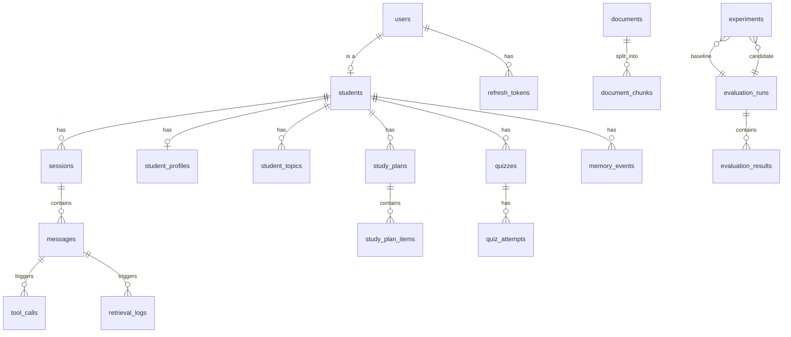

# Data Model

**Status:** Phase 1. Two schema files, with different jobs:

| File | What it is |
|---|---|
| [`db/schema.sql`](../db/schema.sql) | The full **designed** schema — all 20 tables, including the RAG, memory, quiz and evaluation tables that later phases add. A design reference, not executed by the application. |
| [`db/schema.current.sql`](../db/schema.current.sql) | **Generated** from a database built by `alembic upgrade head` — the schema that actually exists today (8 tables). Regenerate with `scripts/dump_schema.sh`. |

Alembic migrations under `backend/migrations/` are authoritative. A migration arrives with the code
that reads it, so Phase 1 creates only the identity and conversation tables.

## 1. Entity overview



## 2. Why `users` and `students` are separate

`users` is an authentication identity; `students` is a learner profile. An admin or a future teacher
account needs the former without the latter, and the eval/admin endpoints authorize on
`users.role`. Keeping them merged would force nullable learner columns on every admin row and make
"delete my learning data but keep my login" impossible.

## 3. Conversation model

A **turn** is not a row — it is a group. `messages` uses `(session_id, turn_index, seq)` so one turn
can hold the user utterance, any tool messages, and the assistant reply in order, which is what the
LLM history and the e2e tests both need.

Two columns exist purely because of barge-in (ARCHITECTURE §5.3):

| Column | Meaning |
|---|---|
| `was_interrupted` | the assistant turn was cut off by the user |
| `spoken_prefix_chars` | how much of `content` actually reached the speaker |

`content` stores the **spoken prefix** for interrupted turns; `unspoken_remainder` stores the rest
for debugging and is never replayed into model context. Getting this wrong means the mentor refers to
explanations the student never heard — the single most likely correctness bug in the whole system,
which is why it is represented in the schema rather than inferred at read time.

`latency_ms jsonb` carries the nine stage marks per turn. It is JSONB rather than nine columns
because the set of marks will change across phases, and the voice-latency suite aggregates it rather
than the application querying individual keys.

## 4. Memory model

- `student_profiles` — one row per student, `version` bumped on every applied change.
- `student_topics` — `UNIQUE (student_id, subject, topic)`; `mastery` in `[0,1]`, `evidence_count`,
  `last_seen_at`. Updated by EWMA, never replaced (ARCHITECTURE §12).
- `memory_events` — append-only audit of every *proposed* delta with `applied bool` and
  `extractor_version`. This is what makes a wrong profile explainable and a changed extractor
  replayable; without it, long-term memory is unfalsifiable.

## 5. RAG storage and indexing

```sql
-- Serving path: one fixed-dimension embedding column.
embedding vector(768)                             -- multilingual-e5-base
CREATE INDEX ON document_chunks USING hnsw (embedding vector_cosine_ops)
    WITH (m = 16, ef_construction = 64);
CREATE INDEX ON document_chunks USING gin (content_tsv);
CREATE INDEX ON document_chunks USING gin (content gin_trgm_ops);   -- Indic-script fallback
CREATE INDEX ON document_chunks (document_id, chunk_index);
CREATE INDEX ON document_chunks USING gin (metadata jsonb_path_ops);
```

Four constraints worth stating explicitly, because each one shaped a decision:

1. **pgvector columns are fixed-dimension**, and its HNSW index supports at most 2000 dimensions. A
   768-dim serving column cannot hold a 1024-dim `bge-m3` vector. Multi-model embedding experiments
   therefore build **side tables** (`chunk_embeddings_<model_slug>`) created by the eval harness, and
   the serving table is only migrated once an experiment wins. Qdrant's named vectors would avoid
   this; the trade is accepted in [ADR-0005](adr/0005-vector-store-pgvector.md) and flagged as
   [M-01](PHASE_0_AUDIT.md).
2. **`content_tsv` is a generated column** using the `simple` configuration, not `english` — a
   mixed-language corpus cannot share one stemmer, and `simple` at least behaves predictably. English
   stemming is applied per-document via a language-specific expression index only where
   `documents.language = 'en'`.
3. **`content_tsv` is not BM25.** `ts_rank_cd` is a cover-density rank, not Okapi BM25. The lexical
   arm is described as "lexical" throughout; where a real BM25 comparison is needed, the retrieval
   suite scores candidates offline with `rank_bm25` and reports both. Calling `ts_rank_cd` "BM25"
   would be the kind of imprecision that collapses under one interview question
   ([M-03](PHASE_0_AUDIT.md)).
4. **`documents.source_hash` is UNIQUE** so re-ingestion is idempotent and the ingestion lock has a
   natural key.

## 6. Evaluation storage

`evaluation_runs` holds one row per suite execution: suite name, `dataset_version`, `config jsonb`
(provider + model + retriever settings), `git_sha`, `mlflow_run_id`, `summary_metrics jsonb`.
`evaluation_results` holds per-case rows so failure analysis is a query, not a re-run.

`experiments` links a `baseline_run_id` and a `candidate_run_id`, names the **single** variable
changed, and records the decision (`adopt` / `reject` / `inconclusive`) with a rationale. The
`variable_changed` column is deliberately a single value: an experiment that changed two things is
recorded as two experiments or as `inconclusive`.

MLflow is the source of truth for experiment metrics; the Postgres summary is a one-way mirror
written at run completion so the dashboard never depends on MLflow being up
([ADR-0013](adr/0013-experiment-tracking-mlflow.md)).

## 7. Conventions

- UUID v4 primary keys (`gen_random_uuid()`), so IDs are safe to surface to clients.
- `timestamptz` everywhere, UTC; no naive timestamps.
- Enumerations as Postgres `ENUM` for values that gate application logic (roles, statuses) and as
  `text` + check constraint for values that will grow (languages).
- `ON DELETE CASCADE` from a student to their learning data, so a deletion request is one statement
  (DPDP Act erasure obligations — see [SECURITY.md](SECURITY.md)).
- No application-level soft deletes in v1; erasure means erasure.

## 8. Guarding against model/migration drift

Phase 1 hit this for real. The migration declared server defaults (`role DEFAULT 'student'`,
`is_active DEFAULT true`, and seven more) that the SQLAlchemy models did not, so
`Base.metadata.create_all` and `alembic upgrade head` produced **different schemas** — and the test
suite, which used `create_all`, was validating a schema that existed nowhere else.

Two changes close it permanently:

1. **The test suite builds its schema by running the migrations** (`tests/conftest.py`), so every
   test exercises the production schema and a forgotten migration fails the suite.
2. **CI runs `alembic check`**, which fails if the models have drifted from the migrations.

## 9. Validation status

`db/schema.sql` was executed against a real PostgreSQL 16.13 instance on 2026-09-17, not merely
eyeballed. Result:

| Check | Result |
|---|---|
| Full DDL applies with `ON_ERROR_STOP=1` | pass — 20 tables, 45 indexes, 24 foreign keys |
| `content_tsv` generated column populates on insert | pass |
| Cascade deletion (`DELETE FROM users`) leaves no orphan sessions or messages | pass |
| `CHECK (NOT was_interrupted OR role = 'assistant')` rejects a bad row | pass |
| `CHECK (mastery BETWEEN 0 AND 1)` rejects `1.5` | pass |

**Not validated:** `CREATE EXTENSION vector`, the `vector(768)` column type, and the HNSW index — the
pgvector extension is not installed in the environment where this check ran, so those two statements
were shimmed out (`vector(768)` → `text`, HNSW index skipped) and remain unverified. They are verified
in Phase 1 against the Compose `pgvector/pgvector:pg16` image, and the Alembic migration test is the
permanent version of this check.
